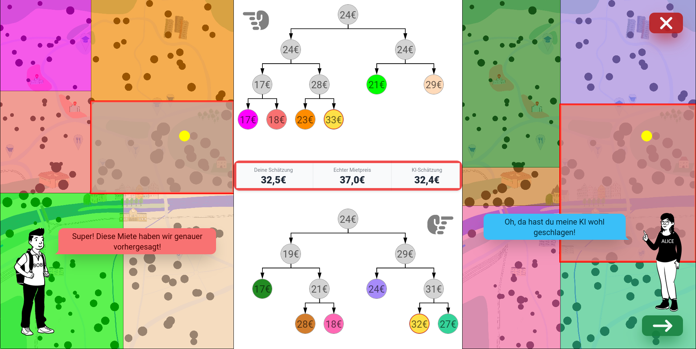

# Teaching people about machine learning by predicting apartment rents
... with decision trees!

## What is this?
This app wants to give you an intuitive understanding of what machine learning is. It's not just neural networks, and it's not black magic.
Your task is to help Bob, a newly arriving student in Tübingen. Bob needs an apartment, but he's not sure which rents are appropriate for which kind of apartments. After all, different parts of the town have different rent standards.
Help him create a so-called 'decision tree' to divide the town into areas with similar rents, and then compete against the AI to see who's better at estimating rents!

The project will be exhibited at the [Stadtmuseum Tübingen](https://www.tuebingen.de/stadtmuseum/) from 11th Feb 2023 to 22nd Oct 2023. Come check it out when you're around :)

This project was bootstrapped with [Create React App](https://github.com/facebook/create-react-app).

## Available Scripts

In the project directory, you can run:

### `npm start`

Runs the app in the development mode.\
Open [http://localhost:3000](http://localhost:3000) to view it in your browser.

The page will reload when you make changes.\
You may also see any lint errors in the console.

### `npm run build`

Builds the app for production to the `build` folder.\
It correctly bundles React in production mode and optimizes the build for the best performance.

The build is minified and the filenames include the hashes.\
Your app is ready to be deployed!

See the section about [deployment](https://facebook.github.io/create-react-app/docs/deployment) for more information.